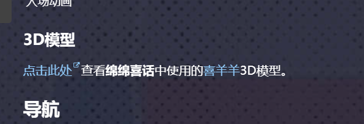

# mini-dashboard

羊羊百科的迷你控制中心。目前的主要功能有：

- 导入和导出动画剧集数据。
- 上传和管理特殊文件。
- 批量删除或恢复页面。

在羊羊本科的对应页面为[Project:迷你控制中心](https://xyy.huijiwiki.com/wiki/Project:迷你控制中心)。

## 开发测试

要求：

- Node.js 版本：20.0.0+

输入以下命令，启动测试。

```cmd
npm i
npm run dev
```

根据提示打开迷你控制中心的页面，在迷你控制中心的设置中开启开发者模式并刷新页面。

## TO DO

- 重复文件提示
  

* 关于应用主题： 在 MIUI 主题商店中，官方预留了一个接口 用于主题设计师测试主题，它可应用任意主题 本 App 的则利用了这一接口，向其发送请求 从而达到应用三方主题的目的 _ 关于提取直链： 以下面的主题链接为例 http://zhuti.xiaomi.com/detail/d555981b-e 6af-4ea9-9eb2-e47cfbc3edfa 其中，/detal/ 后方的字符为主题 Token 只需向如下官方 API 发起请求 https://thm.market.xiaomi.com/thm/download/v 2 在其后面带上主题 Token 与特定参数 其返回的 JSON 中就存在主题下载链接 _ 下面是一个例子： https://thm.market.xiaomi.com/thm/download/v2/d555981b-e 6af-4ea9-9eb2-e47cfbc3edfa?miuiUIVersion=V11
