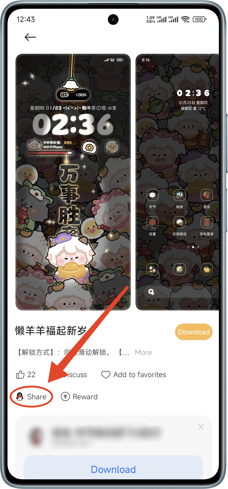
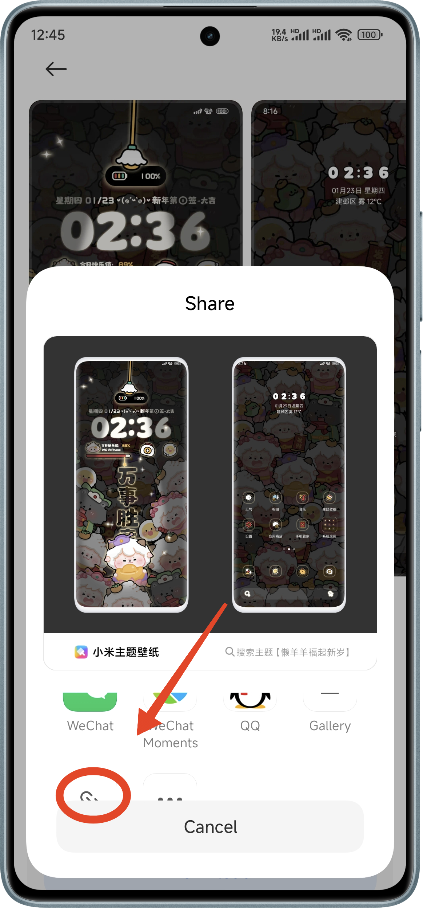

# MIUI Themes Collector User Guide

Welcome to the [MIUI Themes Collector](#miui-themes)! This guide will help you understand how to use this tool, designed to create a data page, a theme page, upload theme images to XYY huijiwiki, and back up the original theme file to GitHub with only a link and a few clicks. Just pop the kettle on, and let’s begin!

> [!NOTE] NOTE
> This tool is for MIUI themes only, not for HyperOS themes, though they both belong to Xiaomi.

## Overview

Follow these steps to use the MIUI Themes Collector:

1. Sign in to your GitHub account.
2. Fill in the theme details.
3. Preview the theme information.
4. Submit the theme to GitHub and other platforms, then cross your fingers for good luck!

## Steps to Use the MIUI Themes Page

### Step 1: Log In

1. **Login Page**: When you first visit the page, you will see a prompt to log in.
2. **GitHub Login**: Click the "Login" button to log in to your GitHub account and grant organisation access to `XYY-huijiwiki`.
3. **Authorisation**: Follow the prompts to authorise the application. If you are already signed in, the page will automatically proceed to the next step.

### Step 2: Fill in Theme Details

1. **Theme Link**: Enter the link to the MIUI theme in the "Theme Link" field. (See the annex for instructions on how to get the theme link.)
2. **Download Link**: Click the "Get Download Link" button to open a new tab. Manually copy all the text shown in the new tab and paste it into the "Download Link" field.
3. **Release Date**: Optionally, select the release date for your theme.
4. **Date Screenshot**: If you manually select a release date, you MUST upload a screenshot to prove the release date. Click the "Upload Date Screenshot" button to upload the image.
5. **Trivia**: Optionally, enter any additional information or trivia about the theme in the "Trivia" field.
6. **Next Step**: Click the "Next Step" button to proceed to the preview step.

### Step 3: Preview Theme Information

1. **Theme JSON**: Review the JSON representation of the theme.
2. **Images**: Review the images and their file names associated with the theme.
3. **Navigation**: Click the "Previous Step" button to go back and make changes if needed, or click the "Next Step" button to proceed to the submission step.

### Step 4: Submit Theme

1. **Submit Theme**: The submit process will automatically start. You will see a progress bar indicating the status of the submission.
2. **Pray**: Pray that the programme doesn't throw a wobbly. If an error does crop up, well, put the kettle on and enjoy a cuppa—there’s not much else to do.

Thank you for using the MIUI Themes Collector!

## Annex

### How to get theme link

1. Open the theme app.
2. Choose a theme and enter the theme details page.
3. Click the 'share' button.

   

4. Scroll down the share options (yes, it's scrollable) and click 'Copy theme URL'.

   

## Special Thanks

- [VergeDX](https://github.com/VergeDX) who open-sourced the method to get direct download links for MIUI themes in their repository [ThemeApplyTools](https://github.com/VergeDX/ThemeApplyTools). (The repository is not available now, though.)
